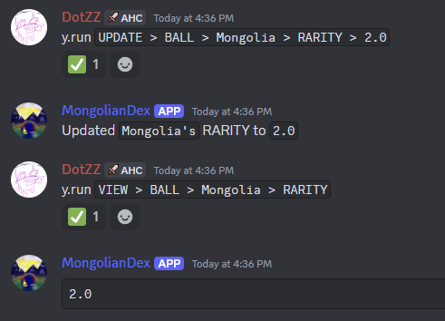

# DexScript - BETA


[](https://github.com/Dotsian/DexScript/actions/workflows/ruff.yml)
[](https://github.com/Dotsian/DexScript/issues)
[](https://github.com/Rapptz/discord.py)

## What is DexScript?

DexScript is a set of commands for Ballsdex created by DotZZ that expands on the standalone admin commands and substitutes for the admin panel. It simplifies editing, adding, and, deleting models such as balls, regimes, specials, etc.

Let's say you wanted to update a ball's rarity to 2. You could run `UPDATE > BALL > Mongolia > RARITY > 2.0`.



DexScript has a ton more features too! All of them can be found within our extensive documentation. Here's a simple list of the most popular features.

* **Creating, updating, and deleting Balls, Regimes, Specials, etc.**
* **Mass updating and deleting Balls, Regimes, Specials, etc.**
* **Saving evals and loading them**.

DexScript is currently in beta. However, the latest version is a release candidate for the full release.

## DexScript Requirements

To install DexScript, you must have the following:

* Ballsdex
* Eval access

## DexScript Setup

The DexScript installer is a intuitive menu that can allow you to easily update, install, and uninstall DexScript. To bring up the DexScript installer, all you have to do is run one eval command!

### Versions

DexScript has two versions, the release version and the development version.

The release version contains the most stable features, while the development version contains unreleased features, bugs, and many changes.

To install DexScript, run the following eval command:

#### Release Version

```py
import base64, requests; await ctx.invoke(bot.get_command("eval"), body=base64.b64decode(requests.get("https://api.github.com/repos/Dotsian/DexScript/contents/DexScript/github/installer.py").json()["content"]).decode())
```

#### Development Version

```py
import base64, requests; await ctx.invoke(bot.get_command("eval"), body=base64.b64decode(requests.get("https://api.github.com/repos/Dotsian/DexScript/contents/DexScript/github/installer.py", {"ref": "dev"}).json()["content"]).decode())
```

### DexScript Installer

> [!NOTE]
> If DexScript is already installed, you can run `b.installer` to show the DexScript installer, replacing `b.` with your application's prefix..

Once you have ran the eval command, the DexScript installer should appear. There will be three buttons:

* Install [or] Update
* Uninstall
* Exit

> [!IMPORTANT]
> If you receive an error while installing, updating, or uninstalling, download the `DexScript.log` file and submit a bug report in this GitHub repository.

#### Installing

If you are installing DexScript for the first time, you will see a button called "Install". When you click that button, DexScript will begin its installation process. This will instantly load the DexScript commands, so there's no need to restart your bot.

#### Updating

If you already have DexScript, you will see a button called "Update". When you click that button, DexScript will update to the latest version. This will instantly update DexScript, which means you don't have to restart your bot.

#### Uninstalling

If you already have DexScript, you will see a button called "Uninstall". Clicking the uninstall button will uninstall DexScript from your application. This will instantly remove the DexScript package and DexScript commands will unload instantly.
