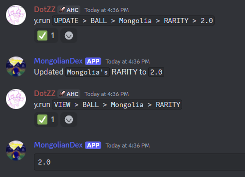

# DexScript - BETA (BD-3.0)


[](https://github.com/Caylies/DexScript/actions/workflows/ruff.yml)
[](https://github.com/Caylies/DexScript/issues)
[](https://github.com/Rapptz/discord.py)

## What is DexScript?

DexScript is a DSL package for Ballsdex created by Cayla that allows you to easily perform operations on balls, regimes, specials, etc.

Let's say you wanted to update a ball's rarity to `2.0`. You could run `UPDATE > BALL > Mongolia > RARITY > 2.0`.



## Installation

Add the following into your `config/extra.toml` file.

```toml
[[ballsdex.packages]]
location = "git+https://github.com/Caylies/DexScript.git@v0.5.1#BD-3.0"
path = "dexscript"
enabled = true
```
